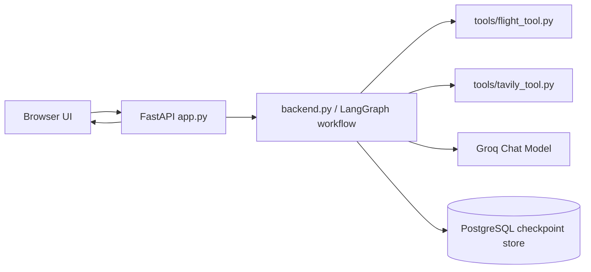

# Trip Planner AI

Trip Planner AI is a FastAPI-based travel planning app that combines live flight lookup, web research, PostgreSQL-backed LangGraph state, and Groq-powered LLM responses to generate practical trip guidance.

## Overview

The application accepts a travel request from the browser, sends it to the backend as a single natural-language message, and returns a structured trip plan. The backend uses a small LangGraph workflow to fetch flight data, gather web research, draft an itinerary, and produce a final AI response.

The frontend is built with plain HTML, CSS, and vanilla JavaScript in `templates/index.html`, `static/style.css`, and `static/script.js`.

## Features

- AI trip planning from a single natural-language request
- Live flight search through AviationStack
- Web research through Tavily
- AI-generated itinerary and final recommendations
- Session continuity via `thread_id`
- PostgreSQL-backed LangGraph checkpointing
- Responsive browser UI for desktop and mobile

## Architecture



Request flow:

1. The browser posts a trip brief to `POST /api/travel`.
2. `app.py` validates the request and calls `run_travel_agent()` from `backend.py`.
3. `backend.py` runs a LangGraph pipeline:
	- `flight_agent` calls `tools/flight_tool.py`
	- `hotel_agent` calls `tools/tavily_tool.py`
	- `itinerary_agent` asks Groq to draft an itinerary
	- `final_agent` asks Groq to format the final response
4. PostgreSQL checkpointing stores graph state using `langgraph-checkpoint-postgres`.
5. The frontend renders the returned strings into summary cards, flight cards, research cards, and itinerary cards.

## Tech Stack

- FastAPI
- Jinja2 templates
- Vanilla JavaScript
- CSS Grid and Flexbox
- LangGraph
- LangChain + langchain-groq
- Groq LLMs
- PostgreSQL via psycopg
- Tavily API
- AviationStack API

## Project Structure

```text
trip-planner/
├── app.py
├── backend.py
├── requirements.txt
├── README.md
├── static/
│   ├── script.js
│   └── style.css
├── templates/
│   └── index.html
└── tools/
    ├── flight_tool.py
    └── tavily_tool.py
```

## Environment Variables

Create a `.env` file with values similar to the following:

```env
DATABASE_URL=your_database_url
GROQ_API_KEY=your_groq_api_key
TAVILY_API_KEY=your_tavily_api_key
AVIATIONSTACK_API_KEY=your_aviationstack_api_key
LANGSMITH_TRACING=true
LANGSMITH_ENDPOINT=https://api.smith.langchain.com
LANGSMITH_API_KEY=your_langsmith_api_key
LANGSMITH_PROJECT=TripPlanner-AI
DEFAULT_ORIGIN_IATA=MAA
```

Notes:

- `DATABASE_URL` is required because the backend initializes a PostgreSQL checkpointer.
- `GROQ_API_KEY` is required for the Groq chat model.
- `TAVILY_API_KEY` is required for web search.
- `AVIATIONSTACK_API_KEY` is required for flight search.
- `DEFAULT_ORIGIN_IATA` is optional and defaults to `MAA` in `tools/flight_tool.py`.
- LangSmith-related variables are surfaced in startup logs, but there is no separate LangSmith client configuration code in this repository.

## Installation

1. Clone the repository.
2. Create a virtual environment:

```powershell
python -m venv .venv
```

3. Activate it:

```powershell
.\.venv\Scripts\Activate.ps1
```

4. Install dependencies:

```powershell
pip install -r requirements.txt
```

5. Create `.env` and add the variables listed above.
6. Start the application:

```powershell
uvicorn app:app --reload
```

Open `http://127.0.0.1:8000` in your browser.

## Usage

1. Enter an origin, destination, travel dates, traveler count, budget, and optional interests.
2. Submit the form.
3. The frontend sends a natural-language request to the backend.
4. The backend returns a final AI trip answer plus flight, hotel, and itinerary text.
5. The UI renders those results into structured cards.

## API / Backend

### `GET /`

- Purpose: serves the main HTML page.
- Response: the `index.html` Jinja template.

### `GET /health`

- Purpose: simple health check.
- Response:

```json
{
	"status": "ok",
	"message": "AI Travel Planner API is running"
}
```

### `POST /api/travel`

- Purpose: runs the trip-planning workflow.
- Expected input:

```json
{
	"message": "Plan a trip from Chennai to Tokyo...",
	"thread_id": "optional-session-id"
}
```

- Validation: `message` must not be empty after trimming.
- Response:

```json
{
	"success": true,
	"thread_id": "user_...",
	"answer": "final AI response text",
	"flight_results": "formatted live flight text",
	"hotel_results": "formatted Tavily research text",
	"itinerary": "generated itinerary text",
	"llm_calls": 4
}
```

- Error response:

```json
{
	"success": false,
	"error": "message"
}
```

## LangGraph and Tools

- `backend.py` builds a `StateGraph` with `flight_agent`, `hotel_agent`, `itinerary_agent`, and `final_agent`.
- `tools/flight_tool.py` resolves natural-language locations to IATA codes and queries AviationStack for live flight data.
- `tools/tavily_tool.py` uses Tavily search results as research input for hotel and destination context.
- PostgreSQL checkpointing is enabled through `PostgresSaver` so a `thread_id` can preserve workflow state.

## Notes on Tracing

The repository loads and prints LangSmith-related environment variables at startup, but it does not contain dedicated LangSmith tracing setup code beyond that environment usage.

## Future Improvements

- Add a dedicated structured schema for the backend response instead of plain text fields.
- Expand the UI to support reusable trip templates and saved trips.
- Improve itinerary parsing if the AI output format becomes more strictly structured.
- Add better display of aviation pricing if a fare API is introduced later.
